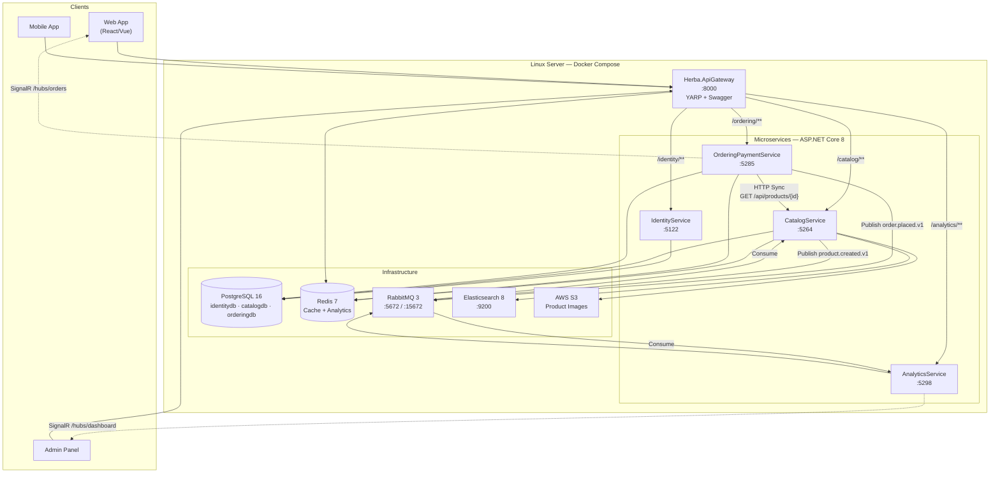
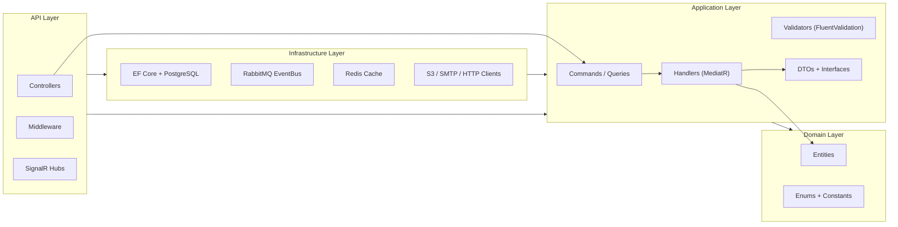
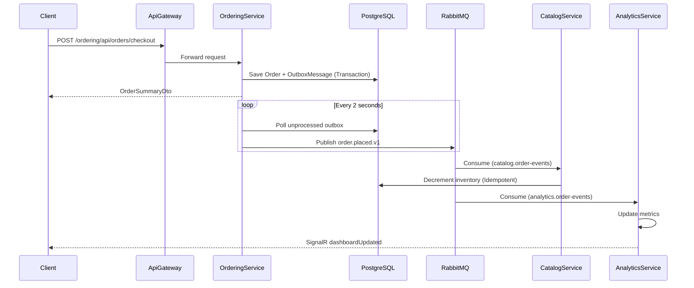

# Herba — Spice & Herb E-Commerce Platform

> **Backend Microservices** built with **ASP.NET Core 8** on **Clean Architecture**, ready to scale on **Linux + Docker**.

---

## Overview

**Herba** is a full backend system for a spice and herb e-commerce platform. The project is designed as independent **Microservices**, each following **Clean Architecture** with **CQRS (MediatR)**, coordinated via **RabbitMQ**, **HTTP**, and **SignalR**.

| Component | Role |
|-----------|------|
| **IdentityService** | Registration, login, JWT, OTP, staff management |
| **CatalogService** | Products, categories, inventory, images, search |
| **OrderingPaymentService** | Carts, orders, payments, invoices |
| **AnalyticsService** | Analytics dashboard + real-time updates |
| **Herba.ApiGateway** | Unified entry point (YARP) + aggregated Swagger |

---

## Architecture Diagram

### 1. System Overview



### 2. Clean Architecture — Per Microservice



### 3. Checkout Event Flow



---

## Project Structure

```
Backend_Herba/
├── HerbaMicroservices.sln
├── docker-compose.yml
├── docker/
│   ├── catalog/Dockerfile
│   ├── ordering/Dockerfile
│   ├── gateway/Dockerfile
│   └── postgres-init/01-create-databases.sql
├── docs/architecture/
│   ├── event-bus-strategy.md
│   ├── sample-service-structure.md
│   └── spice_inventory_schema.sql
└── src/
    ├── BuildingBlocks/
    │   ├── BuildingBlocks.Contracts/     # Integration Events
    │   └── BuildingBlocks.EventBus/      # RabbitMQ Publisher
    ├── Gateway/
    │   └── Herba.ApiGateway/             # YARP Reverse Proxy
    └── Services/
        ├── IdentityService/
        │   ├── IdentityService.Domain/
        │   ├── IdentityService.Application/
        │   ├── IdentityService.Infrastructure/
        │   └── IdentityService.API/
        ├── CatalogService/               # Same layer structure
        ├── OrderingPaymentService/
        └── AnalyticsService/
```

---

## Services & Ports

| Service | Port | Database | Swagger |
|---------|------|----------|---------|
| **ApiGateway** | `8000` | Redis (visitor stats) | `http://localhost:8000/swagger` |
| **IdentityService** | `5122` | `identitydb` | `http://localhost:5122/swagger` |
| **CatalogService** | `5264` | `catalogdb` | `http://localhost:5264/swagger` |
| **OrderingPaymentService** | `5285` | `orderingdb` | `http://localhost:5285/swagger` |
| **AnalyticsService** | `5298` | In-Memory | `http://localhost:5298/swagger` |

### Gateway Routing

| Gateway Path | Target Service | Example |
|--------------|----------------|---------|
| `/identity/**` | IdentityService | `GET /identity/api/auth/me` |
| `/catalog/**` | CatalogService | `GET /catalog/api/products` |
| `/ordering/**` | OrderingPaymentService | `POST /ordering/api/orders/checkout` |
| `/analytics/**` | AnalyticsService | `GET /analytics/api/dashboard/snapshot` |

---

## API Documentation

> All endpoints are auto-documented in **Swagger UI**. Via Gateway: `http://localhost:8000/swagger` (unified OpenAPI from all services).

### IdentityService — `/api/auth`

#### Login

```http
POST /api/auth/login
Content-Type: application/json
```

**Request:**
```json
{
  "email": "admin@herba.local",
  "password": "Admin123!"
}
```

**Response `200 OK`:**
```json
{
  "accessToken": "eyJhbGciOiJIUzI1NiIsInR5cCI6IkpXVCJ9...",
  "expiresAtUtc": "2026-08-20T12:30:00Z",
  "userId": "3fa85f64-5717-4562-b3fc-2c963f66afa6",
  "email": "admin@herba.local",
  "roles": ["Admin"],
  "refreshToken": "abc123...",
  "refreshTokenExpiresAtUtc": "2026-08-27T12:15:00Z"
}
```

#### Register (with OTP)

```http
POST /api/auth/register/request-otp   →  Send OTP to email
POST /api/auth/register               →  Complete registration
```

**Request:**
```json
{
  "email": "user@example.com",
  "password": "SecurePass123!",
  "role": "User",
  "otpCode": "482910"
}
```

#### Additional Endpoints

| Method | Endpoint | Auth | Description |
|--------|----------|------|-------------|
| POST | `/refresh-token` | — | Refresh access token |
| POST | `/logout` | — | Revoke refresh token |
| GET | `/me` | JWT | Current user info |
| PUT | `/profile/me` | JWT | Update profile |
| POST | `/change-password` | JWT | Change password |
| POST | `/forgot-password/request-otp` | — | OTP for password reset |
| POST | `/admin/create-staff` | Admin | Create staff account |
| POST | `/landing/contact` | — | Landing page contact form |

---

### CatalogService — `/api`

#### List Products (public — no JWT)

```http
GET /api/products
```

**Response `200 OK`:**
```json
[
  {
    "id": "7c9e6679-7425-40de-944b-e07fc1f90ae7",
    "sku": "HERB-001",
    "name": "Wild Thyme",
    "description": "Naturally dried wild thyme",
    "categoryId": "a1b2c3d4-e5f6-7890-abcd-ef1234567890",
    "saleUnit": "Gram",
    "unitPrice": 0.05,
    "imageUrl": "https://cdn.herba.com/herbs/thyme.jpg",
    "isActive": true,
    "orderCount": 142,
    "createdAtUtc": "2026-01-15T08:00:00Z"
  }
]
```

#### Create Product (Admin/Staff)

```http
POST /api/products
Authorization: Bearer {JWT}
Content-Type: application/json
```

**Request:**
```json
{
  "name": "Ground Cumin",
  "description": "Premium quality ground cumin",
  "categoryId": "a1b2c3d4-e5f6-7890-abcd-ef1234567890",
  "saleUnit": "Gram",
  "unitPrice": 0.04,
  "imageUrl": null,
  "isActive": true
}
```

#### Adjust Inventory

```http
POST /api/inventory/adjust
Authorization: Bearer {JWT}
```

**Request:**
```json
{
  "productId": "7c9e6679-7425-40de-944b-e07fc1f90ae7",
  "deltaGrams": -500,
  "reason": "Manual adjustment"
}
```

#### Additional Endpoints

| Controller | Endpoints | Auth |
|------------|-----------|------|
| `/api/categories` | Full CRUD | Read: public · Write: Admin/Staff |
| `/api/packages` | CRUD + GET by id | Same policy |
| `/api/naturalblends` | CRUD | Same policy |
| `/api/favorites` | GET, POST, DELETE | JWT (authenticated user) |
| `/api/images` | POST upload to S3 | Admin/Staff |

---

### OrderingPaymentService — `/api`

#### Create Cart

```http
POST /api/carts
Authorization: Bearer {JWT}
```

**Response:**
```json
{
  "cartId": "f47ac10b-58cc-4372-a567-0e02b2c3d479",
  "userId": "3fa85f64-5717-4562-b3fc-2c963f66afa6",
  "status": "Active",
  "subtotal": 0,
  "items": []
}
```

#### Add Item to Cart

```http
POST /api/carts/{cartId}/items
Authorization: Bearer {JWT}
```

**Request:**
```json
{
  "productId": "7c9e6679-7425-40de-944b-e07fc1f90ae7",
  "weightInGramsPerUnit": 250,
  "quantity": 2
}
```

#### Checkout

```http
POST /api/orders/checkout
Authorization: Bearer {JWT}
```

**Request:**
```json
{
  "cartId": "f47ac10b-58cc-4372-a567-0e02b2c3d479",
  "addressId": "b2c3d4e5-f6a7-8901-bcde-f23456789012",
  "paymentMethod": "Cash",
  "note": "Call before delivery"
}
```

**Response `200 OK`:**
```json
{
  "orderId": "c3d4e5f6-a7b8-9012-cdef-345678901234",
  "orderNumber": "ORD-20260820-0042",
  "total": 27.50,
  "currency": "JOD",
  "paymentStatus": "Pending"
}
```

> After checkout: Outbox publishes `order.placed.v1` → Catalog decrements stock → Analytics updates the dashboard.

#### Additional Endpoints

| Method | Endpoint | Auth | Description |
|--------|----------|------|-------------|
| GET | `/api/carts/{cartId}` | JWT | View cart |
| PUT | `/api/carts/{cartId}/items/{itemId}` | JWT | Update quantity |
| DELETE | `/api/carts/{cartId}/items/{itemId}` | JWT | Remove item |
| PUT | `/api/orders/{orderId}/status` | Staff/Admin | Update order status |
| GET | `/api/orders/active` | Staff/Admin | Active orders |
| GET/POST/PUT/DELETE | `/api/addresses` | JWT | Delivery addresses |
| GET | `/api/invoices/{orderId}` | JWT | Invoice details |

---

### AnalyticsService — `/api/dashboard`

#### Dashboard Snapshot

```http
GET /api/dashboard/snapshot
```

**Response:**
```json
{
  "liveVisitors": 12,
  "totalOrders": 1847,
  "totalRevenue": 45230.75,
  "topProductsByWeight": [
    {
      "productId": "7c9e6679-7425-40de-944b-e07fc1f90ae7",
      "label": "Wild Thyme",
      "totalGramsSold": 125000,
      "revenue": 6250.00
    }
  ]
}
```

**SignalR Hub:** `ws://localhost:5298/hubs/dashboard` — event `dashboardUpdated` on every new order.

---

### ApiGateway — Direct Endpoints

| Method | Endpoint | Description |
|--------|----------|-------------|
| GET | `/health` | Liveness |
| GET | `/health/ready` | Readiness (checks Catalog + Ordering) |
| GET | `/api/stats/today` | Today's visitors (Redis) |
| GET | `/api/stats/last-7-days` | Weekly stats |
| GET | `/swagger/unified.json` | Aggregated OpenAPI |

---

## Technology Stack

| Category | Technology | Usage |
|----------|------------|-------|
| **Backend** | C# / .NET 8 | ASP.NET Core Web API |
| **Architecture** | Clean Architecture + CQRS | MediatR + FluentValidation |
| **Database** | PostgreSQL 16 | Database per Service |
| **Cache** | Redis 7 | Cache-Aside for products + Gateway analytics |
| **Search** | Elasticsearch 8 | Product indexing and search |
| **Messaging** | RabbitMQ 3 | Event-Driven Communication |
| **Gateway** | YARP 2.2 | Reverse Proxy + Path Routing |
| **Real-time** | SignalR | Order and dashboard updates |
| **Storage** | AWS S3 + ImageSharp | Product image upload and processing |
| **Auth** | JWT + ASP.NET Identity | HMAC-SHA256, Refresh Tokens |
| **Containerization** | Docker + Compose | Linux deployment |
| **Health** | AspNetCore.HealthChecks | PostgreSQL, Redis, RabbitMQ, URIs |
| **API Docs** | Swashbuckle (Swagger) | OpenAPI 3.0 |

---

## Technical Challenges Solved

### 1. Security

| Challenge | Solution |
|-----------|----------|
| Unified auth across services | JWT signed (HMAC-SHA256) by IdentityService, validated by Catalog and Ordering |
| Role-based access | Roles: `Admin`, `Staff`, `User` — `[Authorize(Roles = "...")]` on controllers |
| Secure refresh tokens | Hashed storage in PostgreSQL + rotation on refresh |
| Safe registration | Email OTP before completing registration / password reset |
| Rate limiting | 120 requests/min/IP on CatalogService |
| CORS | Restricted origins (localhost:3000, 5173, 8000) |
| Error handling | GlobalExceptionMiddleware — no try-catch in controllers |

### 2. Scalability

| Challenge | Solution |
|-----------|----------|
| Service isolation | Database per Service — each microservice is independent |
| Cache-Aside | Redis for products and frequent queries + invalidation on writes |
| Event-Driven | RabbitMQ Topic Exchange — decoupling Ordering, Catalog, and Analytics |
| Outbox Pattern | Reliable event publishing within the same transaction as the order |
| Idempotency | `processed_integration_messages` table — prevents duplicate event processing |
| Pagination | Skip/Take on all entity list endpoints |
| Read optimization | `.AsNoTracking()` + projection to DTOs |
| Search | PostgreSQL GIN Trigram + Elasticsearch for full-text search |
| Gateway | YARP — single entry point, scale-out per cluster |

### 3. Reliability

| Challenge | Solution |
|-----------|----------|
| Lost RabbitMQ messages | Transactional Outbox + Background Publisher (2-second polling) |
| Health monitoring | `/health` + `/health/ready` on Gateway with downstream checks |
| Docker healthchecks | curl-based checks on Catalog, Ordering, Gateway |
| Inventory consistency | Serializable transaction + idempotent consumer |

---

## Event Bus — RabbitMQ

```
Exchange: commerce.events (topic, durable)

Routing Keys:
  ├── order.placed.v1              ← Ordering (Outbox) → Catalog + Analytics
  └── catalog.product.created.v1   ← Catalog (Direct publish)

Queues:
  ├── catalog.order-events         → CatalogService (stock decrement)
  └── analytics.order-events       → AnalyticsService (metrics update)
```

**Integration Event — `order.placed.v1`:**
```json
{
  "eventId": "d290f1ee-6c54-4b01-90e6-d701748f0851",
  "occurredOnUtc": "2026-08-20T12:00:00Z",
  "orderId": "c3d4e5f6-a7b8-9012-cdef-345678901234",
  "orderNumber": "ORD-20260820-0042",
  "userId": "3fa85f64-5717-4562-b3fc-2c963f66afa6",
  "totalAmount": 27.50,
  "lineItems": [
    {
      "productId": "7c9e6679-7425-40de-944b-e07fc1f90ae7",
      "productName": "Wild Thyme",
      "weightInGrams": 500,
      "quantity": 2,
      "unitPrice": 0.05
    }
  ]
}
```

---

## Running on Linux / Docker

### Prerequisites

- Docker 24+ & Docker Compose v2
- .NET 8 SDK (to run Identity and Analytics locally)
- Linux (Ubuntu 22.04+ / Debian), macOS, or WSL2

### 1. Start Infrastructure + Containerized Services

```bash
git clone <repo-url>
cd Backend_Herba
docker compose up -d --build
```

**What starts automatically:**

| Container | Image | Port |
|-----------|-------|------|
| herba-postgres | postgres:16 | 5432 |
| herba-redis | redis:7 | 6380 |
| herba-rabbitmq | rabbitmq:3-management | 5672, 15672 |
| herba-elasticsearch | elasticsearch:8.13.4 | 9200 |
| herba-kibana | kibana:8.13.4 | 5601 |
| herba-catalog-api | Custom Dockerfile | 5264 |
| herba-ordering-api | Custom Dockerfile | 5285 |
| herba-gateway | Custom Dockerfile | 8000 |

### 2. Run Services Outside Docker

Identity and Analytics are not in docker-compose — run them on the host:

```bash
# Terminal 1 — Identity
dotnet run --project src/Services/IdentityService/IdentityService.API

# Terminal 2 — Analytics
dotnet run --project src/Services/AnalyticsService/AnalyticsService.API
```

> Gateway connects to Identity via `host.docker.internal:5122`.

### 3. Verify

```bash
curl http://localhost:8000/health
curl http://localhost:8000/health/ready
curl http://localhost:8000/catalog/api/products
```

### 4. Manual Build

```bash
dotnet restore
dotnet build HerbaMicroservices.sln
```

---

## End-to-End Test Flow

```
1. POST /identity/api/auth/login          → JWT Token
2. GET  /catalog/api/products             → Pick a product
3. POST /ordering/api/carts               → Create cart
4. POST /ordering/api/carts/{id}/items    → Add product
5. POST /ordering/api/addresses           → Delivery address
6. POST /ordering/api/orders/checkout     → Place order
   ↳ Outbox → RabbitMQ → Catalog (stock) → Analytics (dashboard)
7. GET  /analytics/api/dashboard/snapshot → Verify metrics
```

**Dev Admin Account:** `admin@herba.local` / `Admin123!`

---

## BuildingBlocks — Shared Libraries

| Project | Contents |
|---------|----------|
| `BuildingBlocks.Contracts` | `IntegrationEvent`, `OrderPlacedIntegrationEvent`, `ProductCreatedIntegrationEvent` |
| `BuildingBlocks.EventBus` | `IEventBus`, `RabbitMqEventBus`, `EventBusConstants` |

---

## Additional Documentation

| File | Contents |
|------|----------|
| [docs/architecture/event-bus-strategy.md](docs/architecture/event-bus-strategy.md) | RabbitMQ + Outbox + Idempotency strategy |
| [docs/architecture/sample-service-structure.md](docs/architecture/sample-service-structure.md) | Clean Architecture layer structure |
| [docs/architecture/spice_inventory_schema.sql](docs/architecture/spice_inventory_schema.sql) | Spice inventory schema |

---

## Technical Capabilities Summary

```
✅ Microservices Architecture (4 services + Gateway)
✅ Clean Architecture + CQRS + MediatR + FluentValidation
✅ Database per Service (PostgreSQL)
✅ Event-Driven (RabbitMQ + Outbox Pattern)
✅ API Gateway (YARP) + Unified Swagger
✅ JWT Authentication + Role-Based Authorization
✅ Redis Distributed Cache (Cache-Aside)
✅ Elasticsearch Full-Text Search
✅ AWS S3 Image Storage
✅ SignalR Real-Time Updates
✅ Docker Compose on Linux
✅ Health Checks + Readiness Probes
✅ Idempotent Event Consumers
✅ Rate Limiting + CORS + Global Exception Handling
```

---

<p align="center">
  <strong>Herba Backend</strong> — Built with ASP.NET Core 8 · Clean Architecture · Event-Driven Microservices
</p>
